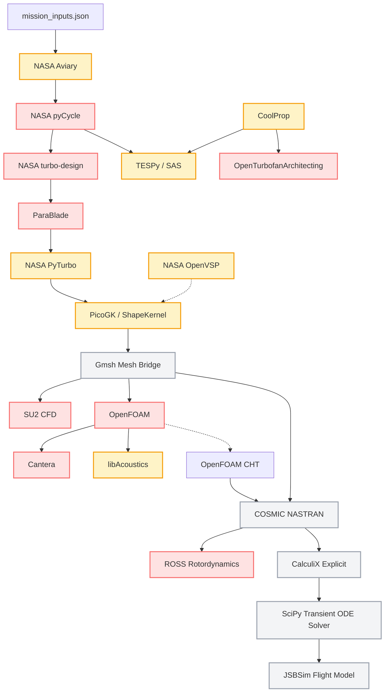

# NASA Jet Engine Design Workflow - Codebase Map

This document provides a comprehensive mapping of the project structure, software stack, physical domains, and mathematical formulations integrated into the 20-Gate multidisciplinary design optimization (MDAO) turbofan pipeline.

---

## 📂 1. Directory Structure & Folder Hierarchy

The target directory `C:\Users\suryakumar M S\Desktop\jet_engine_resources` is organized as follows:

```
jet_engine_resources/
│
├── agents.md                             # Multi-agent role guidelines and audit rules
├── Library_index.md                      # Index of all 20 open-source software libraries
├── README.md                             # Foundations and nomenclature for C# ShapeKernel
├── workflow.md                           # Master aerothermal, structural, and simulation blueprint
├── library_priority_report.md            # Rank and prioritization justification of libraries
│
├── books and research papers/            # Comprehensive physics literature repository
│   ├── Aircraft Propulsion Farokhi 2ed.pdf
│   ├── Rolls Royce - The Jet Engine.pdf
│   ├── aircraft-engine-design_compress.pdf
│   ├── aircraft-gas-turbine-tecnology-by-irwine-treagerpdf_compress.pdf
│   ├── fundamentals-of-jet-propulsion-with-applications-by-flack-rd_compress.pdf
│   ├── 978-3-030-79945-8.pdf (Springer: Gas Turbine Emissions)
│   ├── 978-981-95-0942-3.pdf (Springer: Compressor Aerodynamics)
│   ├── 1-s2.0-S2212540X25000069-main.pdf (Paper: Blade stress)
│   ├── 19760017154.pdf (NASA: Compressor and turbine design)
│   ├── 19930086868.pdf (NASA: Rotordynamics simulation)
│   ├── 20050207438.pdf (NASA: LEWICE icing model description)
│   ├── AD0722283.pdf (NASA: Throughflow and radial equilibrium)
│   ├── ecp17132909.pdf (Paper: Combustor acoustics and emissions)
│   └── s40095-022-00489-2.pdf (Paper: Shaft torsional fatigue)
│
├── libraries/                            # Source code folders for the open-source engineering libraries
│   ├── Aviary-main/Aviary-main/
│   ├── cantera-main/cantera-main/
│   ├── CoolProp-master/CoolProp-master/
│   ├── libAcoustics-master/libAcoustics-master/
│   ├── NASTRAN-95-master/NASTRAN-95-master/ (COSMIC NASTRAN)
│   ├── OpenFOAM-dev-master/OpenFOAM-dev-master/
│   ├── OpenTurbofanArchitecting-main/OpenTurbofanArchitecting-main/
│   ├── OpenVSP-main/OpenVSP-main/
│   ├── parablade-master/parablade-master/
│   ├── PicoGK-main/PicoGK-main/
│   ├── pyCycle-master/pyCycle-master/
│   ├── pyturbo-aero-main/pyturbo-aero-main/
│   ├── ross-main/ross-main/
│   ├── SU2-master/SU2-master/
│   ├── tespy-dev/tespy-dev/
│   └── turbo-design-main/turbo-design-main/
│
└── misceleneous/                         # (Empty) Intended for secondary resources
```

---

## 🔄 2. Workflow Stages & Programmatic Gates

The pipeline proceeds in five distinct phases governed by **20 Computational Gates**:

```mermaid
gantt
    title MDAO Jet Engine Design Workflow Stages
    dateFormat  X
    axisFormat %d
    
    section Phase 1 Sizing
    Thermodynamic Cycle (pyCycle) :active, a1, 0, 10
    Radial Sizing & Throughflow (turbo-design) :active, a2, 10, 20
    Airfoil Parameterization (ParaBlade, PyTurbo) :active, a3, 20, 30
    
    section Phase 2 CAD
    Solid procedural SDF voxels (PicoGK) :active, b1, 30, 45
    Nacelle & Cowl sizing (OpenVSP) :active, b2, 40, 50
    Mesh generation (Gmsh, BDF) :active, b3, 45, 55
    
    section Phase 3 Fluid
    Aerodynamic CFD (SU2) :active, c1, 55, 75
    Combustion Reacting flows (OpenFOAM, Cantera) :active, c2, 60, 80
    Secondary Air & Icing (TESPy, LEWICE3D) :active, c3, 65, 80
    
    section Phase 4 Thermo-Struct
    Conjugate Heat Transfer (OpenFOAM CHT) :active, d1, 80, 95
    Thermal Stress & Creep (NASTRAN SOL 106) :active, d2, 85, 105
    Rotordynamics & Bearings (ROSS) :active, d3, 90, 105
    
    section Phase 5 Dynamics
    Vibration resonance & flutter (NASTRAN SOL 103) :active, e1, 105, 115
    Transient throttle integration (SciPy ODEs) :active, e2, 110, 120
    Ingestion containment & dynamic impact (CalculiX Explicit) :active, e3, 115, 130
    Acoustics & Flight simulation (libAcoustics, JSBSim) :active, e4, 120, 140
```



---

## 💻 3. Software Dependencies

To run the MDAO pipeline autonomously, the system must have the following runtime executables and compilers:

1.  **C#/.NET 8.0 SDK:** Required to compile and execute **PicoGK** and the procedural geometry **ShapeKernel**.
2.  **Python 3.10+ Environment:** Primary orchestration platform containing:
    *   `openmdao` (base for pyCycle and Aviary)
    *   `scipy`, `numpy`, `sympy` (math, dynamics integration, coordinate transformations)
    *   `cantera`, `coolprop`, `tespy` (combustion, fluid property matrices, heat loops)
    *   `ross`, `openturbofanarchitecting` (bearing assemblies, shaft dynamics, gearbox calculations)
    *   `smt`, `mlflow` (surrogate modeling, regression, training tracking)
3.  **Solver Binaries (CLI):**
    *   **SU2 CFD** (`SU2_CFD`, `SU2_DOT`, `SU2_DEF` - compressible fluid solvers)
    *   **OpenFOAM** (`simpleFoam`, `reactingFoam`, `chtMultiRegionFoam` - CFD executables)
    *   **NASTRAN** (`nastran` / COSMIC solver for structural dynamic solves SOL 101, 103, 106, 112)
    *   **CalculiX Explicit** (`ccx` - dynamic explicit structural impact)
    *   **Gmsh** (`gmsh` - command-line CAD meshing utility)
    *   **JSBSim** (`JSBSim` - flight dynamic model executive)

---

## 🔗 4. Library Interdependencies



---

## 📈 5. Physics Dependency Chain

The multidisciplinary design loop cascades through distinct physical physics domains:

$$\begin{aligned}
\text{Aircraft Mission Sizing (Kinematics \& Weight Estimation)} &\rightarrow \text{Gas Turbine Thermodynamic Cycle (Brayton Cycle \& Gas Dynamics)} \\
&\rightarrow \text{Meridional Turbomachinery Flowpath (Radial Equilibrium)} \\
&\rightarrow \text{3D Airfoils \& Mechanical Cowling (Procedural Kinematics)} \\
&\rightarrow \text{High-Speed Centrifugal Blade Loading (Elasticity \& Solid Mechanics)} \\
&\rightarrow \text{Compressible Flow Aerodynamics \& Combustion (Viscous Navier-Stokes \& Chemical Kinetics)} \\
&\rightarrow \text{Conjugate Heat Transfer (Convective Heat Transfer \& Solid Heat Conduction)} \\
&\rightarrow \text{High-Temperature Mechanical Stress (Non-Linear Viscoplasticity \& Creep)} \\
&\rightarrow \text{Flexible Rotor Assemblies (Rotordynamics \& Bearing Dynamics)} \\
&\rightarrow \text{Natural Blade Frequencies (Vibrations, Campbell Crossings \& Aerodynamic Flutter)} \\
&\rightarrow \text{Fluid-Structure Ingestion Containment (Explicit Shock Dynamics \& Impulsive Impact)} \\
&\rightarrow \text{Fluid-Boundary Noise Generation (Aeroacoustics)} \\
&\rightarrow \text{Integrated System Controls (Transient ODE Controls \& 6-DoF Aircraft Flight Dynamics)}
\end{aligned}$$

---

## 🧮 6. Equation Dependency Chain

The mathematical convergence of the design is driven by a series of coupled analytical and differential equations across stations:

```
[MDAO Thermodynamic Station Bounds]
         │
         ▼
 1. Station Gas State Equations (pyCycle / CoolProp):
    h = h(T), s = s(P, T) ---> Calculates pressures & temperatures at all 1D engine stages.
         │
         ▼
 2. Euler's Turbomachinery Work Matching:
    w_stage = U_2 * V_theta2 - U_1 * V_theta1 ---> Matches turbine power to compressor/fan work.
         │
         ▼
 3. Radial Equilibrium Equation (turbo-design / AD0722283.pdf):
    dp/dr = rho * ( (V_theta^2 / r) - V_m * (dV_m / dr) ) ---> Sizes hub-to-tip velocity profiles.
         │
         ▼
 4. Parametric Geometry Curve Generation (ParaBlade / PyTurbo):
    Lofts aerofoils using NURBS profiles S(u,v).
         │
         ▼
 5. Centrifugal Loading Stress (1-s2.0-S2212540X25000069-main.pdf):
    sigma_cent = rho * omega^2 * r * (A_hub / A_tip) ---> Gate 2 structural feasibility filter.
         │
         ▼
 6. Navier-Stokes RANS & Combustion Species (SU2 / OpenFOAM):
    d(rho * u_i)/dt + d(rho * u_i * u_j)/dx_j = -dp/dx_i + d(tau_ij)/dx_j + S_i ---> Computes stall limits & PF.
         │
         ▼
 7. Conjugate Heat Conduction (OpenFOAM CHT):
    div( k * grad(T) ) = 0 ---> Solves 3D temperature fields on blades & casing liners.
         │
         ▼
 8. Norton-Bailey Creep & Viscoplasticity (NASTRAN SOL 106):
    d(epsilon_creep)/dt = A * (sigma)^n * t^m * exp(-Q_c / R*T) ---> Calculates Gate 4A structural life.
         │
         ▼
 9. Shaft Whirling & Critical Speeds (ROSS / 19930086868.pdf):
    M*q_ddot + (C + G)*q_dot + K*q = F(t) ---> Campbell diagram resonance check (Gate 4B & 5A.1).
         │
         ▼
10. Spool Transient Spinning ODEs (SciPy integrator / scipy.integrate.solve_ivp):
    I * d(omega)/dt = Torque_Turbine - Torque_Compressor ---> Evaluates surge margin on throttle sweeps.
         │
         ▼
11. Lighthill / FW-H Far-Field Acoustics (libAcoustics):
    Helmholtz wave solver mapping boundary pressure fluctuations to decibel SPL ---> Chap 14 Noise Gate.
         │
         ▼
12. 6-DoF Flight Dynamic Deceleration (JSBSim):
    m * (v_dot + omega x v) = F_aero + F_reverse_thrust + F_braking ---> Computes stopping distance on runway (Gate 5E).
```

