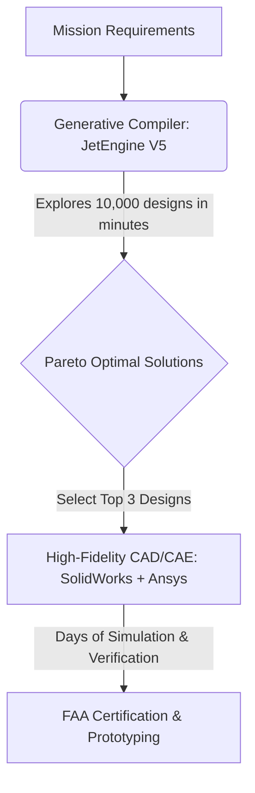
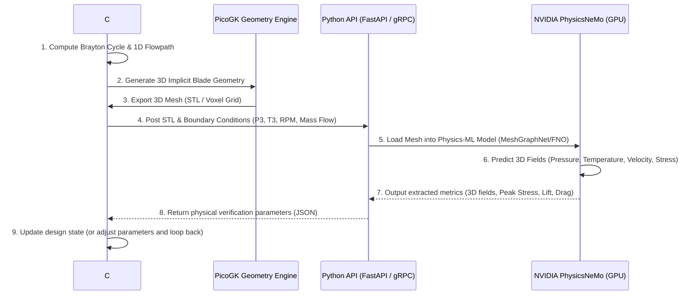

# JetEngine V5 Audit & NVIDIA PhysicsNeMo Integration Blueprint

This document analyzes the mathematical and physical fidelity of the `JetEngine V5.cs` computational design platform, compares its capabilities to industrial tools like SolidWorks and Ansys, explains NVIDIA's **PhysicsNeMo** (formerly Modulus) framework, and outlines a concrete architecture to integrate Physics-ML into the existing C#/PicoGK design compiler.

---

## 1. The Reality Check: JetEngine V5 vs. Ansys & SolidWorks

To understand if this codebase can "beat" SolidWorks or Ansys, we must distinguish between **generative design compilers (low-fidelity/rapid optimization)** and **physical validation engines (high-fidelity field solvers)**.

### Comparative Capabilities Matrix

| Feature / Metric | JetEngine V5 (C# / PicoGK) | SolidWorks | Ansys (Fluent, Mechanical, LS-DYNA) |
| :--- | :--- | :--- | :--- |
| **Physics Solver Core** | Algebraic correlations, 1D meanline & 5-streamline Katsanis throughflow. | 3D Finite Element Method (FEA) & finite-volume CFD (SolidWorks Flow). | 3D Navier-Stokes (FVM) & structural/thermal FEA solvers (millions of cells). |
| **Geometry Engine** | Implicit voxels via PicoGK / LEAP71 (mathematically generated). | Parametric B-Rep CAD (solid modeling, sketches, features). | Can import CAD, but uses specialized meshes (hex/polyhedral/unstructured). |
| **Execution Speed** | **Milli-seconds to Seconds** (thousands of design options/second). | **Minutes** (manual CAD drawing and standard structural meshing/solving). | **Hours to Days** (high-density meshes, multi-stage turbomachinery CFD). |
| **Optimization Loop** | Automated closed-loop (NSGA-II Pareto sweeps with auto-correction). | Manual design studies or basic parametric optimization. | Highly advanced but computationally expensive optimization (Adjoint solvers). |
| **Certification Fidelity** | None. (Heuristic and empirical approximations only). | Low to Medium. (Good for simple load paths, not flight certification). | **Gold Standard**. (FAA/EASA certification relies heavily on Ansys solvers). |

### Can it "Beat" SolidWorks and Ansys?

*   **No, for high-fidelity verification and safety certification:** A 1D/2D correlation-based tool cannot replace Ansys. Ansys solves the actual governing partial differential equations (Navier-Stokes, Navier-Cauchy elasticity, Maxwell's equations) across a discretized mesh of millions of points. Without resolving boundary layer separation, tip vortices, thermal gradients, and material contact mechanics in 3D, a design cannot be certified for commercial flight.
*   **Yes, for conceptual design speed, exploration, and automation:** In traditional design, a team of engineers takes weeks in CAD (SolidWorks) and CAE (Ansys) to run through a dozen design iterations. They must manually model, mesh, set boundary conditions, solve, and analyze. `JetEngine V5` can explore **thousands of complete engines in minutes**, automatically adjusting geometry to fix gate violations, running genetic algorithms to find Pareto-optimal tradeoffs (TSFC vs. Weight vs. NOx), and exporting a 3D printable STL. 

In aerospace engineering, these paradigms co-exist:


---

## 2. Mathematical & Physical Gaps in JetEngine V5

While `JetEngine V5` represents a massive step up from prior iterations (adding throughflow solvers, Campbell diagrams, and mission models), it still relies on simplified algebraic proxies. Beyond the items you listed (Full CFD, Full FEA, Cantera chemistry, Adjoints, and Certification physics), the following math and physics are missing for a complete preliminary design:

### A. Aerodynamics & Turbomachinery
1.  **True Radial Equilibrium (Throughflow):** The `ThroughflowSolver` uses a simplified scaling for $V_m$ rather than solving the **Non-Isentropic Radial Equilibrium Equation (NIREE)**:
    $$\frac{1}{\rho}\frac{\partial P}{\partial r} = \frac{V_\theta^2}{r} - V_m \frac{\partial V_m}{\partial m} \cos \epsilon + \frac{D V_m}{Dt} \sin \epsilon$$
    Without this, radial gradients of entropy, enthalpy, and pressure are inaccurate, yielding incorrect blade profiles at the hub and tip.
2.  **Blade-Row Wakes and Stator-Rotor Clocking:** As rotor blades spin past stator vanes, they pass through viscous velocity wakes. This causes dynamic aerodynamic loading, generating noise and inducing vibrational fatigue.
3.  **Active Tip Clearance Control (ACCC):** Blade tips expand due to centrifugal force and thermal growth. If they touch the casing, it causes a "rub"; if the gap is too wide, efficiency drops due to tip leakage. Real engines use active cooling air on the casing to match thermal expansion.

### B. Combustion & Heat Transfer
1.  **Combustor Liner Cooling:** Modern combustors must protect their metal walls from flame temperatures exceeding $2200\text{ K}$ using effusion/slot cooling films. Sizing these cooling flows is critical since they reduce the air available for combustion.
2.  **Turbine Blade Radiation Heat Transfer:** At temperatures above $1600\text{ K}$, thermal radiation between the combustor gas, vanes, and rotors is a major heat source. Simple convective correlations (Dittus-Boelter) underestimate blade metal temperatures.
3.  **Acoustic Instabilities (Combustor Screech):** Unsteady heat release couples with acoustic waves inside the combustor cavity, causing pressure oscillations that can structurally destroy the engine in seconds.

### C. Structures & Rotor Dynamics
1.  **Low-Cycle Fatigue (LCF) and Thermo-Mechanical Fatigue (TMF):** Real blade damage is driven by start-stop flight cycles (takeoff thermal gradients combined with centrifugal stress). The current model uses Larson-Miller creep (which is time-dependent) but ignores transient thermal-cycle fatigue.
2.  **Disk Mistuning:** Manufacturing tolerances mean no two blades are identical. This "mistuning" breaks the axial symmetry, causing localization of vibration energy in a single blade, which leads to premature fatigue failure.
3.  **Contact Friction Damping:** Turbines use under-platform dampers or shroud-to-shroud contact surfaces to dissipate vibrational energy. This nonlinear contact mechanics must be simulated to prevent flutter.

---

## 3. NVIDIA PhysicsNeMo (Modulus) Overview

**NVIDIA PhysicsNeMo** (which rebranded the **NVIDIA Modulus** framework) is a Scientific Machine Learning (SciML) platform designed to build and train **Physics AI models**. 

Instead of using standard numerical grids to solve PDEs, it combines physical equations (governed by loss functions) with raw simulation data:

```
                  Traditional Solvers (Ansys/OpenFOAM)
                      Mesh Grid --> Solve PDEs --> 3D Field
                                                     |
                                                     v (Takes Hours)
                                                
                  PhysicsNeMo (Physics AI Surrogate)
                      Geometry + BCs --> Neural Net --> 3D Field
                                                     |
                                                     v (Takes Milliseconds)
```

### Key Subcomponents
1.  **PhysicsNeMo-CFD:** Models specialized in fluid dynamics. It uses architectures like **Fourier Neural Operators (FNO)** and **MeshGraphNets** to predict pressure and velocity fields directly from geometry.
2.  **PhysicsNeMo-Sym:** Focuses on Physics-Informed Neural Networks (PINNs). It uses symbolic algebra to write partial differential equations directly into the PyTorch loss function, meaning the network learns physics without needing simulation training data.
3.  **PhysicsNeMo-Curator:** High-performance ETL (Extract, Transform, Load) pipelines to ingest CAD files (STLs, OBJs) and output voxel grids, point clouds, or graphs ready for neural network training.

---

## 4. Integration Architecture: PhysicsNeMo + C# / PicoGK

To integrate PhysicsNeMo into the `JetEngine` C# application, we establish a **Python-C# bridge**. The heavy training and deep learning inference occur on a GPU in Python (using PhysicsNeMo), while the geometric compilation (PicoGK) and cycle balancing remain in C#.



### Step-by-Step Integration Plan

### Step 1: Off-Line Surrogate Training (The Python Pipeline)
Before the C# application can run real-time physics predictions, we must train the PhysicsNeMo models.
1.  **Dataset Generation:** Write a C# script to sweep engine geometry parameters (blade thickness, chord, twist, sweep) and export 5,000 different blade variations as STL meshes via PicoGK.
2.  **Simulation Batching:** Run batch simulations of these 5,000 shapes in an open-source CFD solver (e.g., OpenFOAM or SU2) and FEA solver (e.g., CalculiX) to generate "ground truth" 3D fields.
3.  **Model Training:** Use **PhysicsNeMo-Curator** to process the meshes, and train a **MeshGraphNet** (which is excellent for irregular CAD meshes) or a **3D Fourier Neural Operator (FNO)**:
    *   **CFD Net:** Input = Blade 3D Mesh + Inlet Total Pressure/Temp + Rotational Speed $\rightarrow$ Output = 3D Velocity ($V_x, V_y, V_z$), Static Pressure ($P$), and Temperature ($T$).
    *   **FEA Net:** Input = Blade 3D Mesh + Centrifugal RPM + Static Pressure distribution (from CFD Net) $\rightarrow$ Output = 3D Von Mises Stress ($\sigma$) and Deflection fields.

### Step 2: Live Inference API Server
Host the trained PhysicsNeMo models as a local REST or gRPC service using Python and PyTorch. We can run this server on an NVIDIA GPU workstation.

**Example Python API Server (`server.py`):**
```python
from fastapi import FastAPI, UploadFile, File, Form
import torch
import trimesh
from physicsnemo.cfd.models import MeshGraphNetSurrogate

app = FastAPI()

# Load pretrained PhysicsNeMo models
cfd_surrogate = MeshGraphNetSurrogate.load_from_checkpoint("cfd_blade_model.ckpt").cuda()
fea_surrogate = MeshGraphNetSurrogate.load_from_checkpoint("fea_blade_model.ckpt").cuda()

@app.post("/analyze_blade")
async def analyze_blade(
    file: UploadFile = File(...),
    inlet_Pt_kPa: float = Form(...),
    inlet_Tt_K: float = Form(...),
    rpm: float = Form(...)
):
    # 1. Read STL mesh
    mesh_data = await file.read()
    mesh = trimesh.load(trimesh.util.wrap_file(mesh_data), file_type='stl')
    
    # 2. Preprocess mesh to graph representation for MeshGraphNet
    nodes, edges = convert_mesh_to_graph(mesh, inlet_Pt_kPa, inlet_Tt_K, rpm)
    
    # 3. GPU Inference (takes ~15ms)
    with torch.no_grad():
        cfd_output = cfd_surrogate(nodes.cuda(), edges.cuda())
        pressure_field = cfd_output[:, 0] # Extract surface pressures
        
        # Pass pressure forces and RPM to FEA model
        fea_output = fea_surrogate(nodes.cuda(), edges.cuda(), pressure_field)
        stresses = fea_output[:, 0]
        deflections = fea_output[:, 1]
    
    # 4. Extract design parameters
    max_stress_mpa = float(stresses.max().cpu().numpy())
    aerodynamic_drag_n = float(calculate_drag(mesh, pressure_field))
    aerodynamic_lift_n = float(calculate_lift(mesh, pressure_field))
    
    return {
        "max_stress_mpa": max_stress_mpa,
        "drag_force_n": aerodynamic_drag_n,
        "lift_force_n": aerodynamic_lift_n,
        "converged": True
    }
```

### Step 3: C# Bridge Implementation
Update the validation gates in `JetEngine V5.cs` to call the PhysicsNeMo server.

**Example C# Integration Code:**
```csharp
using System.Net.Http;
using System.Threading.Tasks;
using System.Text.Json;

public static class PhysicsNeMoClient
{
    private static readonly HttpClient client = new HttpClient();

    public class ValidationResponse
    {
        public double max_stress_mpa { get; set; }
        public double drag_force_n { get; set; }
        public double lift_force_n { get; set; }
        public bool converged { get; set; }
    }

    public static async Task<ValidationResponse> QueryPhysicsAI(
        string stlPath, double inletPt_Pa, double inletTt_K, double rpm)
    {
        var requestContent = new MultipartFormDataContent();
        
        // Load the STL mesh generated by PicoGK
        var fileStream = File.OpenRead(stlPath);
        requestContent.Add(new StreamContent(fileStream), "file", Path.GetFileName(stlPath));
        
        // Add boundary conditions
        requestContent.Add(new StringContent((inletPt_Pa / 1000.0).ToString()), "inlet_Pt_kPa");
        requestContent.Add(new StringContent(inletTt_K.ToString()), "inlet_Tt_K");
        requestContent.Add(new StringContent(rpm.ToString()), "rpm");

        var response = await client.PostAsync("http://localhost:8000/analyze_blade", requestContent);
        response.EnsureSuccessStatusCode();
        
        var jsonString = await response.Content.ReadAsStringAsync();
        return JsonSerializer.Deserialize<ValidationResponse>(jsonString);
    }
}
```

This bridge allows you to replace `ThermoStructural.AnalyzeAllStages` and `AeroValidator.ValidateBlades` with:
```csharp
// In ThermoStructural.cs (V5):
var response = PhysicsNeMoClient.QueryPhysicsAI("hpt_blade.stl", Pt3, Tt4, RPM).Result;

double safetyFactor = yieldStrength_MPa / response.max_stress_mpa;
bool passed = safetyFactor >= 1.5;
```

---

## 5. Moving to Differentiable Adjoint Design Optimization

By integrating PhysicsNeMo, you transition from **numerical search** to **gradient-directed optimization**. 

Standard neural networks are fully differentiable (meaning we can compute $\nabla_{\text{geometry}} \text{Performance}$). Instead of running NSGA-II (which is a gradient-free genetic algorithm that must sample thousands of random engines to find improvements), we can utilize **adjoint automatic differentiation**:

1.  **Formulate Loss:** Let the loss be $L = \text{TSFC} + \text{Weight}$.
2.  **Backpropagation:** Run backpropagation through the PhysicsNeMo neural network to get:
    $$\frac{\partial L}{\partial \mathbf{X}_{\text{shape}}}$$
    where $\mathbf{X}_{\text{shape}}$ represents the geometric coefficients defining the blade profile (camber line, thickness, twist distribution).
3.  **Gradient Descent:** Directly update the C# LEAP71 ShapeKernel parameters in the direction of the gradient:
    $$\mathbf{X}_{\text{shape}}^{new} = \mathbf{X}_{\text{shape}}^{old} - \alpha \frac{\partial L}{\partial \mathbf{X}_{\text{shape}}}$$

This allows the compiler to converge on the mathematically optimal 3D aerodynamic blade shape in only **10 to 15 design updates**, rather than running a genetic population of thousands of engines.
