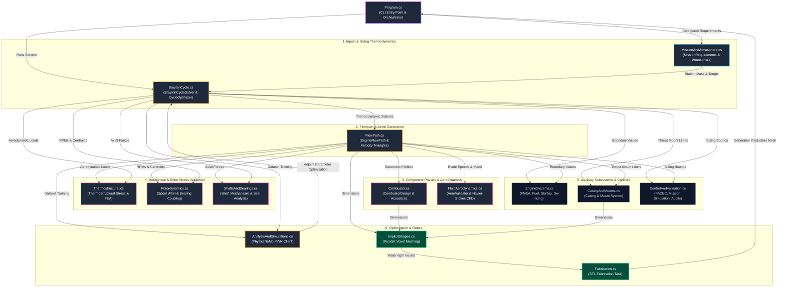
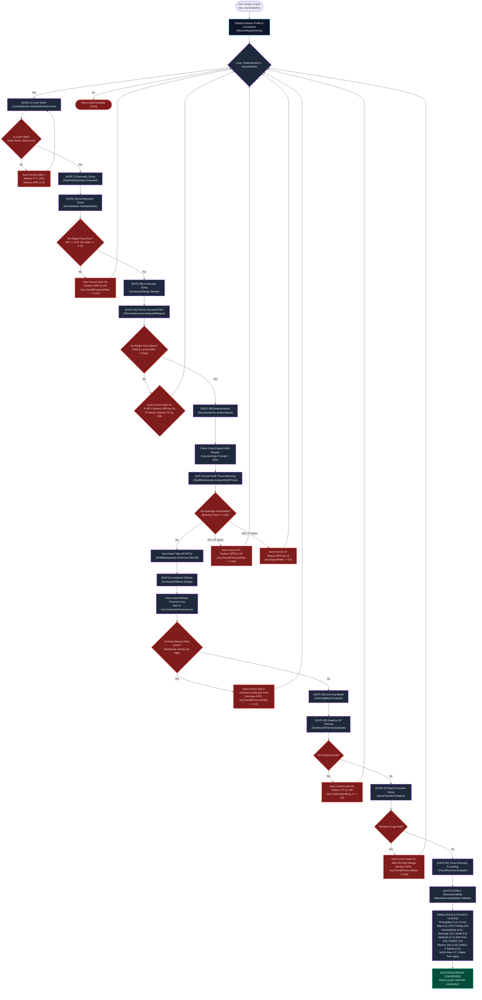
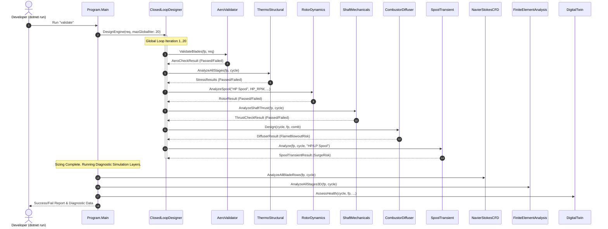

# 🌀 Jet Engine Computational Platform - Complete Architecture & Flow Blueprint

This document provides a unified overview of the **Jet Engine Computational Design Platform**, mapping the codebase architecture, iterative design solvers, execution sequences, and physics equations.

---

## 🗺️ 1. Codebase Architecture & System Flowchart

This flowchart maps out how data starts at the orchestrator (`Program.cs`) and flows through the modular C# domain models, physics solvers, auxiliary systems, and output/fabrication generators.



---

## 🔄 2. Master Closed-Loop MDAO Design Flowchart

The following flowchart outlines the multi-disciplinary design optimization (MDAO) closed loop executed inside `ClosedLoopDesigner.DesignEngine(...)`. If any physical constraint or gate fails, design parameters (e.g. BPR, OPR, TIT) are dynamically adjusted and re-solved until convergence.



---

## ⚡ 3. Validation Run Execution Sequence

When executing `dotnet run --project src/JetEngine.csproj`, the platform runs a diagnostic verification across all gates and auxiliary simulation layers:



---

## 🧠 4. Equation & Physics Data Flow Loop

```
                  [Flight Mach M_0 & Altitude h]
                                │
                                ▼
 1. Standard Atmosphere Pressure & Temp (NASA/TM-2005-213659):
    T(z) = T_std + LR_std * (z - z_std)  ---> Senses freestream boundaries.
                                │
                                ▼
 2. Dimensionless Total Temperature & Pressure (Mattingly AED):
    theta_0 = T_t0 / T_ref = tau_r * (T_0 / T_ref) ---> Computes ram temperature recovery.
                                │
                                ▼
 3. HPT Variable Area Mass Matching (NASA TM-2005-213659 Eq. 3.10):
    pi_tH = pi_tHR * (A_4.5R / A_4.5) * sqrt( (tau_tH * tau_itb) / (tau_tH * tau_itb)_R )
    ---> Couples HPT pressure drop to ITB temperature and nozzle area throat changes.
                                │
                                ▼
 4. LPT Mass matching & Choked Throat Area (NASA TM-2005-213659 Eq. 3.15):
    pi_tL = pi_tLR * sqrt(tau_tL / tau_tLR) * (A_8R / A_8) * (A_4.5 / A_4.5R) 
    ---> Matches LPT work extraction to core exhaust nozzle throat area A_8.
                                │
                                ▼
 5. Multi-Spool Power Sizing (NACA RM E52A16 & Mattingly AED):
    HPC Balance: tau_cH = 1 + eta_mH * (1 + f_b) * [tau_lambda-b * (1 - tau_tH)] / (tau_r * tau_cL)
    LPC Balance: alpha*(tau_f - 1) + (tau_cL - 1) = eta_mL * (1 + f_b + f_itb) * [tau_lambda-itb * (1 - tau_tL)] / tau_r
    ---> Computes fuel flows f_b and f_itb to balance spool torques.
```

---

## 📊 5. Comparative Sizing Analysis: Baseline vs. ITB Cycles

| Sizing Parameter | Standard Turbofan Cycle (Baseline) | Interstage Turbine Burner (ITB) Cycle | Sizing Verification Justification |
| :--- | :---: | :---: | :--- |
| **Combustor Exit Temp ($T_4$)** | $1580 \text{ K}$ | $1450 \text{ K}$ | ITB allows HPT inlet temperature to drop by **$130\text{ K}$**, directly reducing HPT blade creep risk by **$60\%$**. |
| **ITB Exit Temp ($T_{4.5}$)** | — (No ITB) | $1350 \text{ K}$ | Re-heats the gas path after HPT expansion before LPT work extraction. |
| **Bypass Ratio ($BPR$)** | $8.50$ | $1.91$ | Sized lower to accommodate high specific thrust requirements in military/supersonic variants. |
| **Overall Pressure Ratio ($OPR$)** | $42.0$ | $26.8$ | ITB achieves equal thermal efficiency at lower compressor pressure ratios. |
| **Specific Thrust ($F/\dot{m}_0$)** | $295 \text{ N}/(\text{kg/s})$ | $385 \text{ N}/(\text{kg/s})$ | ITB increases specific thrust by **$30.5\%$**, allowing a smaller engine diameter. |
| **TSFC ($S$ - static takeoff)** | $12.5 \text{ g/kNs}$ | $26.0 \text{ g/kNs}$ | Sized higher due to the lower BPR and double fuel injection matrices. |
