# 🚀 Complete Open-Source NASA Jet Engine Systems Engineering Blueprint

This master blueprint details the physical, mathematical, and programmatic engineering workflows to design, simulate, and validate a production-level turbofan engine. Every subsystem design is mapped to the open-source software stack (**NASA Aviary, pyCycle, NASA turbo-design, NASA CEA, Code_Aster, CalculiX, NASA PyTurbo, ParaBlade, SMT, MLflow, PicoGK, OpenFOAM, libAcoustics, CoolProp, Prefect, and JSBSim**). It details how data flows programmatically, defines the exact JSON structure of the design inputs, and details how **NASA-grade Computational Data Gates** are applied to halt failed designs in milliseconds, avoiding wasted supercomputer hours.

---

## 📥 Sizing & Engineering Inputs (The Master Input File)

The entire design and simulation loop is driven by a single structured inputs file: `mission_inputs.json`. This ensures that rather than hardcoding variables, the entire pipeline reads boundary limits, aerodynamic requirements, and material constants programmatically.

Below is the master JSON input schema that initiates the design loop:

```json
{
  "mission_profile": {
    "target_range_nmi": 3200.0,
    "cruise_mach": 0.78,
    "cruise_altitude_ft": 35000.0,
    "payload_passengers": 150,
    "takeoff_field_length_limit_ft": 6000.0,
    "nox_emissions_limit_g_kn": 48.0,
    "noise_limit_epndb": 85.0,
    "icing_liquid_water_content_g_m3": 1.5,
    "icing_mean_effective_diameter_microns": 20.0,
    "landing_stopping_distance_limit_ft": 4500.0,
    "rto_speed_knots": 145.0
  },
  "thermodynamic_cycle_targets": {
    "bypass_ratio_bpr": 8.5,
    "overall_pressure_ratio_opr": 42.0,
    "fan_pressure_ratio_fpr": 1.65,
    "combustor_exit_temp_t4_k": 1580.0,
    "turbine_cooling_air_bleed_fraction": 0.08,
    "gearbox_ratio": 3.25,
    "initial_fuel_air_ratio_far": 0.034
  },
  "structural_materials": {
    "fan_blade": {
      "alloy": "Titanium Ti-6Al-4V",
      "density_kg_m3": 4430.0,
      "yield_strength_mpa": 880.0,
      "ultimate_strength_mpa": 950.0,
      "max_temp_k": 650.0
    },
    "turbine_blade": {
      "alloy": "CMSX-4 (Single-Crystal Nickel-base)",
      "density_kg_m3": 8700.0,
      "yield_strength_at_1200k_mpa": 620.0,
      "creep_limit_at_1200k_100hr_mpa": 450.0,
      "thermal_expansion_coefficient": 1.28e-5,
      "tbc_material": "7YSZ (Yttria-Stabilized Zirconia)",
      "tbc_thickness_microns": 200.0,
      "tbc_thermal_conductivity_w_mk": 1.5
    },
    "combustor_liner": {
      "alloy": "Haynes 230",
      "density_kg_m3": 8970.0,
      "yield_strength_at_1100k_mpa": 290.0,
      "lcf_fatigue_limit_10k_cycles_mpa": 180.0
    },
    "shaft": {
      "alloy": "Maraging Steel 300",
      "density_kg_m3": 8000.0,
      "shear_modulus_gpa": 77.0,
      "yield_strength_mpa": 1900.0,
      "torsional_fatigue_limit_mpa": 550.0
    },
    "outer_casing": {
      "alloy": "Inconel 718",
      "density_kg_m3": 8190.0,
      "yield_strength_mpa": 1030.0,
      "ultimate_strength_mpa": 1240.0
    }
  },
  "rotordynamics_sizing_bounds": {
    "shaft": {
      "outer_diameter_limit_m": 0.12,
      "inner_diameter_limit_m": 0.08,
      "allowable_gyroscopic_whirl_deviation_percent": 15.0
    },
    "bearings": {
      "front_ball_bearing_axial_stiffness_n_m": 1.5e8,
      "rear_roller_bearing_radial_stiffness_n_m": 2.2e8,
      "damping_coefficient_n_s_m": 8.0e3
    }
  },
  "nozzle": {
    "type": "convergent",
    "throat_area_m2": 0.282,
    "exit_area_ratio": 1.0,
    "bypass_nozzle_area_m2": 1.18
  },
  "vsv_vbv_schedule": {
    "vsv_max_angle_deg": 12.0,
    "vsv_stages_active": [1, 2, 3, 4],
    "vbv_bleed_fraction_max": 0.05,
    "schedule_source": "pycycle_offdesign_maps.json"
  },
  "bird_strike": {
    "far_class": "large_single",
    "mass_kg": 1.814,
    "velocity_m_s": 150.0,
    "impact_angle_deg": 90.0,
    "hail_diameter_mm": 40.0
  },
  "maintenance": {
    "tbo_hours": 25000,
    "blade_inspection_cycles": 5000,
    "rul_alert_threshold_hours": 2000,
    "gearbox_oil_change_hours": 3000
  },
  "acoustic_liner": {
    "target_impedance_rayl": 415.0,
    "cell_depth_mm": 25.0,
    "facesheet_porosity": 0.08,
    "liner_length_mm": 450.0,
    "duct_coverage_fraction": 0.75
  },
  "anti_icing": {
    "bleed_temp_k": 550.0,
    "bleed_fraction_of_hpc": 0.005,
    "cowl_coverage_angle_deg": 60.0,
    "piccolo_tube_holes": 24
  }
}
```

---

## 🗺️ Master Aero-Propulsion & Structural Design Flowchart

Below is the complete open-source multidisciplinary optimization (MDAO) loop. It connects thermodynamic cycles, radial equilibrium flowpaths, aircraft weights, generative 3D CAD, aerodynamic CFD, reacting combustion flows, thermal-mechanical structural FEA, secondary air systems, dynamic control transients, aircraft braking/deceleration, and flight simulations.

```mermaid
flowchart TD
    %% Styling
    classDef nasa fill:#1e293b,stroke:#38bdf8,stroke-width:2px,color:#f8fafc;
    classDef csharp fill:#1e293b,stroke:#a855f7,stroke-width:2px,color:#f8fafc;
    classDef solver fill:#1e293b,stroke:#f59e0b,stroke-width:2px,color:#f8fafc;
    classDef gate fill:#7f1d1d,stroke:#f87171,stroke-width:2px,color:#fee2e2;
    classDef success fill:#064e3b,stroke:#34d399,stroke-width:2px,color:#ecfdf5;

    subgraph Phase1 ["1. Thermodynamic, Weight & Streamline Throughflow Sizing (1D/2.5D)"]
        A["Master JSON Input File<br>(mission_inputs.json)"] --> B1["NASA Aviary<br>Aircraft Sizing & Weights"]
        B1 -->|Thrust Envelope| B2["pyCycle (NASA)<br>Thermodynamic Cycle Solver"]
        B2 -->|Off-Design VSV Scheduling| B3["Compressor / Fan Maps<br>(Active Stator Angle Sizing)"]
        B3 --> B4["NASA turbo-design (2.5D)<br>Streamline Throughflow Solver"]
        B4 --> C["2D Velocity Triangles<br>Katsanis' Radial Equilibrium"]
        C --> D1["ParaBlade / pyNURBS<br>Parametric Airfoils"]
    end
    class B1,B2,B4 nasa;
    class D1 solver;

    %% Gate 1: Thermodynamics
    D1 --> G1{"[GATE 1]<br>Work Match & Surge Margin >= 15%?<br>(pyCycle Balance Check)"}
    class G1 gate;
    G1 -->|NO: Fail Cycle| B2
    
    %% Surrogate Model Interceptor (SMT + MLflow)
    G1 -->|YES: Validated| SMT{"[SURROGATE INTERCEPT]<br>SMT Kriging Model Active?<br>(MLflow Model Registry)"}
    class SMT solver;
    
    subgraph Phase2 ["2. Algorithmic Voxel & Nacelle CAD Generation (3D)"]
        SMT -->|NO: Call Solvers| E["PicoGK / ShapeKernel (C#)<br>Procedural Voxel Engine"]
        E -->|Voxel Solid| F["Hollow Turbine Blades + TBC Coated Walls"]
        E -->|Voxel Solid| H["Casing, Shafts, Bearings, Combustor Shell"]
        SMT -->|NO: Call Solvers| H2["NASA OpenVSP<br>Nacelle, Inlet Cowl, Nozzle & Reverser Doors"]
    end
    class E,F,H csharp;
    class H2 nasa;

    subgraph Phase25 ["2.5. Voxel-to-Mesh Data Bridge"]
        F & H & H2 --> I1["PicoGK Watertight STL Export"]
        I1 --> I2["Gmsh (Mesh Sizing Fields)"]
        I2 --> I3["CalculiX BDF Bulk Deck / OpenFOAM Mesh"]
    end
    class I2,I3 solver;

    %% Gate 2: Centrifugal Stress
    I3 --> G2{"[GATE 2]<br>Turbine Centrifugal Load Check?<br>(CalculiX SOL 101 / Hoop stress)"}
    class G2 gate;
    G2 -->|NO: Stress Too High| D1

    subgraph Phase3 ["3. Fluid Dynamics, Reacting Flows & Emissions (CFD)"]
        G2 -->|YES: Passed Structural| J["SU2 CFD (CLI)<br>3D Blade RANS + OpenVSP Nacelle & Reverser Aerodynamics"]
        G2 -->|YES: Passed Structural| J2["SU2 CFD (Nozzle)<br>Axisymmetric Nozzle Drag & Cv/Cd Solver"]
        G2 -->|YES: Passed Structural| K["OpenFOAM ReactingFlow<br>(reactingFoam + Flamelet FGM Kinetics)"]
        K --> K2["Cantera (Emissions PSR)<br>Perfectly Stirred Reactor"]
        G2 -->|YES: Passed Structural| K3["Secondary Air System (SAS)<br>NASA SAS codes / TESPy"]
        G2 -->|YES: Passed Structural| K4["Fuel Loop & cavitation checks<br>CoolProp + TESPy"]
        G2 -->|YES: Passed Structural| K5["OpenFOAM icing / Messinger<br>3D Inlet Ice Accretion Solver"]
    end
    class J,J2,K solver;
    class K2,K3,K4,K5 nasa;

    %% Parallel Fluid Gates (Aero, Combustion, Nozzle, SAS, Icing, Fuel)
    J --> G3A{"[GATE 3A]<br>Diffusion Factor (DF) <= 0.45?<br>(SU2 Aerodynamic Stall)"}
    K --> G3B{"[GATE 3B]<br>Combustor Pattern Factor (PF) <= 0.1?<br>(OpenFOAM CHT)"}
    K2 --> G3C{"[GATE 3C]<br>Emissions NOx/CO <= CAEP/8?<br>(Cantera PSR / Zeldovich Limit)"}
    J2 --> G3H{"[GATE 3H]<br>Nozzle Cv >= 0.98, Cd >= 0.95?<br>(SU2 nozzle CFD)"}
    K3 --> G3D{"[GATE 3D]<br>Seal Leakage <= 1.5%?<br>(Secondary Air System)"}
    K5 --> G3E{"[GATE 3E]<br>Ice Blockage & FOD Safe?<br>(FAR 25 App C / SLD Icing)"}
    K4 --> G3G{"[GATE 3G]<br>Fuel Pump Cavitation Safe?<br>(CoolProp Vapor Lock)"}
    
    class G3A,G3B,G3C,G3H,G3D,G3E,G3G gate;
    
    G3A -->|NO: Flow Separated| D1
    G3B -->|NO: Hot Spots| K
    G3C -->|NO: Fail: stoichiometry feed| B2
    G3H -->|NO: Redesign Nozzle| H2
    G3D -->|NO: Gas Ingestion| E
    G3E -->|NO: Blockage| H2
    G3G -->|NO: Cavitation| K4

    subgraph Phase4 ["4. Thermostructural, Gearbox & Torsional Fatigue"]
        G3A & G3B & G3C & G3H & G3D & G3E & G3G -->|YES: Passed Fluid Gates| L["OpenFOAM CHT<br>(chtMultiRegionFoam + TBC region)"]
        L -->|Conjugate Heat Map| M1["Code_Aster (FEA)<br>Coupled Thermo-Mechanical Stress & Creep"]
        M1 --> M2["Shaft Torsional Fatigue Analysis<br>(CalculiX Dynamic Rainflow)"]
        H -->|Rotor/Stator Interfaces| N1["ROSS (Rotordynamics)<br>Timoshenko Shaft assemblies"]
        N1 --> N2["OpenTurbofanArchitecting + TESPy<br>Gearbox oil lube circuit & cooler sizing"]
    end
    class L,N2 solver;
    class M1,M2,N1 nasa;

    %% Gate 3F: Wall-temperature fatigue dependent check
    L --> G3F{"[GATE 3F]<br>Liner LCF Damage D <= 0.1?<br>(Haynes 230 Code_Aster Fatigue)"}
    class G3F gate;
    G3F -->|NO: Shell Fatigue| E

    %% Gate 4: Structural Creep & Whirl
    M1 --> G4A{"[GATE 4A]<br>Creep, Yield & TBC Life Met?<br>(Code_Aster Norton-Bailey Limit)"}
    N1 --> G4B{"[GATE 4B]<br>Rotor Critical Speeds Clear?<br>(ROSS Gyroscopic Whirling Margin)"}
    M2 --> G4C{"[GATE 4C]<br>Shaft Fatigue D <= 0.1?<br>(Dynamic Torque check)"}
    N2 --> G4D{"[GATE 4D]<br>Lube Oil Temp <= 180°C?<br>(ACOC/FCOC Cooler Heat load)"}
    
    class G4A,G4B,G4C,G4D gate;
    
    G4A -->|NO: Blade Melts/Yields| F
    G4B -->|NO: Shaft Whirl Critical| H
    G4C -->|NO: Shaft Fatigue Failure| H
    G4D -->|NO: Oil Breakdown| N2

    subgraph Phase5 ["5. Vibration, Acoustics, Explicit Dynamics & Strike"]
        G3F & G4A & G4B & G4C & G4D -->|YES: Structural Valid| O["CalculiX (Modal Analysis)<br>Blade Modal Resonance & Flutter"]
        O --> G5A1{"[GATE 5A.1]<br>Campbell Diagram Check?<br>(No Engine-Order crossings in ROSS)"}
        G5A1 -->|YES: Resonance Free| P1["CalculiX Explicit / SPH<br>Blade-Out, SPH Bird Strike & Reverser Door Load Dynamic"]
        G5A1 -->|YES: Resonance Free| P2["libAcoustics (OpenFOAM)<br>Fan, Jet & Reverser Flow Acoustic Analogy"]
    end
    class O,G5A1,P2 nasa;
    class P1 solver;
    class G5A1 gate;
    G5A1 -->|NO: Detune Frequencies| D1

    subgraph Phase55 ["5.5. Dynamic Engine Controls & Transient Sizing"]
        B3 -->|VSV/VBV lookup maps| U1["Pure-Python Spool Dynamic Simulator<br>(scipy.integrate.solve_ivp ODE + VSV scheduling)"]
        P1 & P2 --> U1
    end
    class U1 nasa;

    %% Gate 5: Containment & Mission
    P1 --> G5A{"[GATE 5A]<br>Casing & Reverser Actuator Intact?<br>(CalculiX Explicit Load Containment)"}
    P2 --> G5B{"[GATE 5B]<br>EPNL Noise <= Chapter 14?<br>(FAR Part 36 / libAcoustics)"}
    U1 --> G5C{"[GATE 5C]<br>Transient Surge Margin Safe?<br>(Throttle dynamic sweep with VSV)"}
    U1 -->|Provides: Deceleration Profile| Q["JSBSim (NASA FDM / Python)<br>6-DoF Aircraft Flight Simulation"]
    Q --> G5D{"[GATE 5D]<br>Fuel/Range Delta <= 1%?<br>(Mission Performance)"}
    Q --> G5E{"[GATE 5E]<br>Stopping Distance <= 4500 ft?<br>(Thrust Reverser deceleration)"}
    
    class G5A,G5B,G5C,G5D,G5E gate;
    
    G5A -->|NO: Door Blown| H
    G5B -->|NO: Too Loud| E
    G5C -->|NO: Compressor Surge| U1
    G5D -->|NO: Engine Too Heavy/Inefficient| B2
    G5E -->|NO: Stopping Distance overrun| H2

    %% Surrogate Loop Return (requires meshing checks on new geometries)
    SMT -->|YES: Predict Solver Outputs| J
    
    G5A & G5B & G5C & G5D & G5E -->|YES: Loop Converged| R["[SUCCESS] READY FOR METAL 3D PRINTING"]
    class R success;
```



---

## 📖 Sub-System Engineering: Math, Physics, and NASA Software Blueprints

### 1. 2.5D Streamline Throughflow Sizing (NASA turbo-design)
A major gap exists between 0D/1D cycle calculations (which yield uniform single properties at each station) and 2D blade profiling. To bridge this, we run **NASA turbo-design**, a streamline throughflow solver solving radial equilibrium:
1.  **Radial Equilibrium Equation (NASA AD0722283):**
    $$\frac{d V_m}{d q} = \left[ A \frac{dr}{dq} + B \frac{dz}{dq} \right] V_m + C + \frac{1}{V_m} \left( \frac{d h_t}{d q} - T_s \frac{d s}{d q} - \frac{V_{\theta}}{r} \frac{d(r V_{\theta})}{d q} \right)$$
    *Where $q$ is the quasi-orthogonal coordinate, $V_m, V_\theta$ are meridional and tangential velocities, $s$ is entropy, $h_t$ is total enthalpy, and $r$ is local radius.*
2.  **Solidity & Aerodynamic Stall Limits (NASA SP-290):** Lieblein's Diffusion Factor ($DF$) is sized to verify that blade boundaries do not stall:
    $$DF = 1 - \frac{W_2}{W_1} + \frac{W_{\theta 1} - W_{\theta 2}}{2 \sigma W_1} \le 0.45 \quad \text{(Gate 3A)}$$
    Where $W_1, W_2$ are relative velocities, and $\sigma$ is cascade solidity.

---

### 2. Algorithmic Voxel & Nacelle Geometry (PicoGK & NASA OpenVSP)
During Phase 2, the 3D geometry is procedurally built. Rather than treating the nacelle and cowl as external shapes, **NASA OpenVSP** is programmatically driven via its Python API to generate the exact aerodynamic casing skin:
1.  **Cowl Lip Sizing:** Sized for perfect diffusion without boundary layer separation during crosswind or high-angle-of-attack flight.
2.  **Geometry Mesh Export (Phase 2.5):** OpenVSP writes `.step` or `.stl` surfaces. The voxel bridge (`Gmsh`) grids the volumes into structured boundaries, ensuring `SU2` CFD can solve the exact Nacelle Installation Drag.

---

### 3. Combustor Chemistry, Turbulence-Chemistry Interaction (TCI), and Zeldovich $NO_x$ Kinetics (Cantera & OpenFOAM)
If Gate 3C (Emissions Index check) fails, the pipeline does not simply rerun blindly. The emissions index check triggers a **Stoichiometric Feedback Loop** that bridges Cantera's chemistry library with OpenFOAM reacting CFD:
1.  **Turbulence-Chemistry Interaction (TCI) & Flamelet FGM Kinetics (OpenFOAM):**
    To resolve the 50% underprediction of NOx in standard 0D Perfectly Stirred Reactors, we model the reacting flowfield in OpenFOAM using the **Flamelet Generated Manifold (FGM)** model. The mean species source term $\bar{\omega}_i$ is obtained by integrating the laminar flamelet library with a Joint Probability Density Function (PDF) $P(Z, Z''^2)$ to capture local turbulent temperature fluctuations:
    $$\bar{\omega}_i = \iint \omega_i(Z, C) \cdot P(Z, Z''^2) \cdot dZ \cdot dZ''^2$$
    *Where $Z$ is the mixture fraction, $Z''^2$ is the mixture fraction variance, and $C$ is the reaction progress variable.*
2.  **Zeldovich Thermal $NO_x$ Formation (Springer: Gas Turbine Emissions):**
    $$k_1^+ = 1.8 \times 10^{11} \exp\left( - \frac{38,375}{T} \right) \quad \rightarrow \quad \frac{d[NO]}{dt} = 2 k_1^+ [O][N_2]$$
    *Where the forward reaction rate constant $k_1^+$ scales exponentially with peak combustion temperatures, driving NOx index constraints.*
3.  **Feedback Control & Stoichiometric Rebalancing:** Cantera calculates the deviation from CAEP/8 limits and computes the required change in local fuel-air ratio ($\Delta \text{FAR}$):
    $$\text{FAR}_{new} = \text{FAR}_{old} - \alpha \cdot \left(\text{EI}_{NOx} - \text{EI}_{limit}\right)$$
    This modifies the local primary zone spray distribution, adjusting the dilution air fractions programmatically in `pyCycle` before resolving.

---

### 4. 3D Inlet Icing & Thermodynamic Bleed Cycle Penalty (NASA LEWICE3D & pyCycle)
Engine certification requires compliance with FAR Part 25 Appendix C and Supercooled Large Droplet (SLD) icing conditions. We run **NASA LEWICE3D** or the **OpenFOAM icing solver** coupled with **pyCycle**:
1.  **Eulerian Droplet Conservation:**
    $$\frac{\partial \alpha}{\partial t} + \nabla \cdot (\alpha \vec{U}_d) = 0$$
    *Where $\alpha$ is droplet volume fraction, and $\vec{U}_d$ is droplet velocity field.*
2.  **Messinger Thermodynamic Glaze/Rime Mass & Energy Balance (NASA TM-2005-213659):**
  * *Mass Balance:*
$$\dot{m}_{imp} + \dot{m}_{in} = \dot{m}_{ice} + \dot{m}_{out} + \dot{m}_{evap}$$

* *Energy Balance:*
$$q_{\text{freeze}} + q_{\text{kin}} + q_{\text{aero}} + q_{\text{sens_in}} = q_{\text{conv}} + q_{\text{evap}} + q_{\text{sens_imp}}$$
3.  **Anti-Icing Bleed Air Thermal Cycle Penalty (Rolls-Royce Ch. 13):**
    Extracting hot HP compressor air to heat the cowl lip degrades compressor pressure ratio ($\pi_c$) and increases thrust specific fuel consumption ($S.F.C.$). We model this cycle penalty inside the `pyCycle` thermodynamics loop:
    $$\Delta h_{bleed} = \dot{m}_{anti-ice} \cdot (h_{bleed} - h_{inlet})$$
    The local enthalpy drop is subtracted at the compressor extraction face, shifting the turbine matching operating line and expanding the required overall pressure ratio ($OPR$) target to guarantee takeoff thrust during icing sweeps.
4.  **Gate 3E:** If ice accretion thickness reduces intake flow area by $>5\%$ or risks shedding ice slabs into the fan (FOD risk), the pipeline rejects the design, activating virtual anti-icing bleed air channels in the PicoGK casing design.

---

### 5. Fuel Hydraulic & Cavitation Modeling (CoolProp + TESPy)
The fuel supply network must deliver Jet-A under pressure without experiencing vapor lock or pump cavitation. We model the fuel circuit using **CoolProp** for Jet-A properties and **TESPy** for the hydraulic grid:
1.  **Net Positive Suction Head (NPSH) Check:**
    $$\text{NPSH}_{available} = \frac{P_{inlet} - P_{vapor}}{\rho \cdot g} \ge \text{NPSH}_{required}$$
    *CoolProp programmatically computes the local vapor pressure ($P_{vapor}$) of Jet-A at dynamic flight temperatures and altitude pressures to ensure pump cavitation limits are not crossed.*
2.  **Gate 3G:** If vapor lock margins drop below 10%, the fuel line diameters are resized.

---

### 6. High-Temperature structural Creep & Thermal Fatigue (Code_Aster)
NGVs, turbine blades, and combustor shells experience massive thermal stresses under gas path temperatures.
1.  **Norton-Bailey Viscoplastic Creep (Code_Aster SOL 106 equivalent):**
    $$\frac{d\epsilon_{cr}}{dt} = A \cdot \sigma^n \cdot t^m \cdot \exp\left( - \frac{Q_c}{R T} \right)$$
    *Where $A, n, m, Q_c$ are material constants, $\sigma$ is Von Mises stress, and $T$ is temperature.*
2.  **Gate 3F & 4A:** Thermostructural mesh deformations must satisfy the creep lifetime and thermal fatigue damage criteria ($D_{\text{liner}} \le 0.1$ for 10,000 engine start cycles).

---

### 7. Gearbox Dynamic Lube Oil Circuit Sizing (TESPy)
Planetary gearboxes lose up to 300 HP as heat. We model a closed lube loop using **TESPy** and **CoolProp** oil matrices to size the Air-Cooled Oil Cooler (ACOC) and Fuel-Cooled Oil Cooler (FCOC) heat exchangers:
1.  **Heat Dissipation Sizing:**
    $$\dot{Q}_{lube} = \dot{m}_{oil} \cdot C_p \cdot (T_{oil, out} - T_{oil, in})$$
2.  **Gate 4D:** The heat exchangers must maintain:
    $$T_{oil} \le 180^\circ\text{C (oil decomposition limit)}$$

---

### 8. Spool Transient Dynamics & Active VSV Scheduling (scipy.integrate)
To maintain 100% open-source, zero-human-intervention pipeline autonomy, we bypass proprietary MATLAB dependencies. We model transient spool dynamic spinnings using Python's **`scipy.integrate.solve_ivp`** to integrate the dynamic spool torque ODEs:
1.  **Active Variable Geometry Stator (VSV) compressor map scheduling:**
    Under off-design deceleration sweeps (Idle speeds $N < 80\%$), the compressor naturally runs into surge (NACA RM E52A16). Sizing calculations must incorporate active Variable Stator Vane (VSV) angular schedules to dynamically adjust compressor pressure ratio:
    $$\pi_c = f\left(N_c, R_{line}, \theta_{VSV}\right)$$
2.  **Spool Dynamic Torque Balance:**
    $$I_1 \frac{d\omega_1}{dt} = \text{Torque}_{LPT} \cdot \eta_{gb} - \text{Torque}_{Fan} - \text{Torque}_{LPC}$$
    $$I_2 \frac{d\omega_2}{dt} = \text{Torque}_{HPT} - \text{Torque}_{HPC}$$
    *Where $I_1, I_2$ are moments of inertia of the low-pressure and high-pressure spools, and $\eta_{gb}$ is gearbox mechanical efficiency.*

---

### 9. Explicit Dynamics Bird Strike & Containment (CalculiX Explicit)
Engine certification (FAR Part 33.76) requires testing fan blade survival under dynamic Foreign Object Debris (FOD) ingestion.
1.  **SPH / CEL Projectile Impact:** We extend the blade-out dynamic containment simulation in **CalculiX Explicit** or `OpenFOAM` using Smoothed Particle Hydrodynamics (SPH) to represent a 4-pound bird projectile impacting the spinning fan blade row.
2.  **Gate 5A:** The casing must contain the resulting structural impact fragments without fracturing.

---

### 10. Integrated Aircraft Deceleration & Braking Systems (Thrust Reversers & Wheel Brakes)

Aerodynamic reverse thrust and mechanical wheel brakes are sized as an integrated deceleration package inside the flight dynamics model to verify landing performance certification.

```
                    ┌───────────────────────────────────────────────┐
                    │      ENGINE REVERSE THRUST DECELERATION       │
                    └───────────────────────┬───────────────────────┘
                                            │
                                            ▼
                             [Thrust Reverser Aerodynamics]
                                - Sized in NASA OpenVSP
                                - Deflects Fan Bypass Flow
                                - SOL 129 Actuator Lock Margins
                                - JSBSim Stopping Distance Gate 5E
```

#### Thrust Reverser & Wheel Brakes Sizing and Integration
Modern turbofans utilize **pivoting blocker doors** or **translating cowls with cascade vanes** to redirect bypass airflow forward, producing reverse thrust:
1.  **Aerodynamic Reverse Sizing (SU2 CFD):**
    OpenVSP builds the translating cowl blocker doors in their deployed position. SU2 CFD computes the mass deflection angles and reverse thrust efficiency ($\eta_{rev}$):
    $$\text{Thrust}_{reverse} = \dot{m}_{bypass} \cdot V_{reverse} \cdot \cos(\theta_{deflection})$$
2.  **Carbon-Carbon Multi-Disk Mechanical Wheel Brakes (JSBSim Sizing):**
    We integrate carbon-carbon friction decay equations to account for kinetic energy absorption and heat fade during braking:
    $$\mu_{brake}(T) = \mu_{ref} \cdot \left[ 1 - \beta \cdot (T_{rotor} - T_{ref}) \right]$$
    *Where $\mu_{brake}(T)$ is the temperature-dependent kinetic friction coefficient of the brake discs, and $T_{rotor}$ is solved via a 1D transient thermal heat sink mass equation:*
    $$M_{disk} C_p \frac{dT_{rotor}}{dt} = F_{normal} \cdot \mu_{brake} \cdot V_{aircraft} - h_{conv} A (T_{rotor} - T_{ambient})$$
3.  **Structural Actuator Margins (CalculiX Transient):**
    During deployment at 140 knots, aerodynamic pressure slams blocker doors. We run a transient structural analysis in CalculiX to verify that the blocker linkages and hydraulic actuator locking mechanism do not buckle or fail under peak reverse pressure.
4.  **Gate 5E (Stopping Distance Check):**
    JSBSim evaluates stopping distance under wet/icy runway profiles. Reversers combined with the thermal wheel brakes must halt the aircraft within a $4500\text{ ft}$ limit, validating the aerodynamic sizing of the reverse flow channels.

---

### 11. Pipeline Orchestration & Surrogate Tracking (Prefect & MLflow)
To replace fragile flat Python scripts, the entire pipeline is structured as a Directed Acyclic Graph (DAG) in **Prefect 3**:
1.  **Prefect DAG:** Orchestrates retries, parallel branches, and automated caching of CAD/CFD meshes.
2.  **MLflow Model Registry:** Logs Kriging/SMT surrogate models, tracking hyperparameters, MSE convergence metrics, and training data coordinates.

---

### 12. Coaxial Multi-Shaft Rotordynamics (ROSS)
Standard rotordynamic models often assume isolated spools. To accurately verify coaxial HP and LP rotor dynamic behavior, we implement cross-coupling inter-shaft stiffness matrices in **ROSS**:
1.  **Coupled Multi-Shaft Timoshenko Equations:**
    $$[M_c]\{\ddot{q}\} + ([C_c] + [G_c])\{\dot{q}\} + [K_c]\{q\} = \{f(t)\}$$
    *Where $[M_c], [C_c], [G_c], [K_c]$ are the combined multi-shaft mass, damping, gyroscopic, and stiffness matrices.*
2.  **Inter-Shaft Bearing Cross-Coupling Stiffness:**
    The LP and HP shafts are physically coupled via an inter-shaft roller bearing. The cross-coupling terms are modeled as:
    $$K_{inter} = \begin{bmatrix} K_{xx} & K_{xy} \\ K_{yx} & K_{yy} \end{bmatrix}$$
    Accounting for these terms is mandatory at **Gate 4B** to prevent critical whirl frequency prediction shifts on Campbell diagrams, ensuring the spools are dynamically decoupled during high-speed gyroscopic precessions.

---

---

## 🛑 The Complete 20-Gate Aerospace Computational Gatekeepers

To protect computational efficiency, the loop is governed by **20 golden NASA-grade Data Gates**:

| Data Gate | Check Phase | Critical Verification Equation | Software | Cost | Action if Fails |
| :--- | :--- | :--- | :--- | :--- | :--- |
| **Gate 1: Thermo** | Spool compressor & turbine balance | $\text{Power}_{Turbine} \ge \text{Power}_{Compressor}$ | **pyCycle** | $0.1\text{ s}$ | **REJECT CYCLE.** Modify BPR, pressure ratios, or $T_4$ in `mission_inputs.json`. |
| **Gate 2: Centrifugal** | Blade centrifugal loading limits | $\sigma_{cent} = C_t \rho \omega^2 r^2 \le \sigma_{yield}$ | **CalculiX** | $10\text{ s}$ | **REJECT GEOMETRY.** Blade is too heavy. Reduce maximum RPM or change taper. |
| **Gate 3A: Stall** | Aerodynamic separation check | $DF \le 0.45$ & $D_{eq} \le 2.0$ | **SU2 CFD** | $1.5\text{ mins}$ | **REJECT AERODYNAMICS.** Flow is separated. Modify blade solidity or airfoil sweep. |
| **Gate 3B: Combustor PF**| Combustor exit thermal patterns | $PF \le 0.1$ | **OpenFOAM / CHT** | $1.5\text{ mins}$ | **REJECT BURNER.** Hot spots detected. Move dilution holes in `PicoGK`. |
| **Gate 3C: Emissions** | Chemical pollutants check | $\text{EI}_{NOx} \le \text{CAEP/8 Limits}$ | **Cantera PSR** | $5\text{ s}$ | **ADJUST STOICHIOMETRY.** Adjust FAR $\rightarrow$ re-run OpenFOAM combustor kinetics. |
| **Gate 3D: SAS Leakage** | Bearing cavity gas seal leakage | $\dot{m}_{leak} \le 1.5\%$ & $P_{cavity} \ge 1.05 P_{gas}$ | **TESPy** | $10\text{ s}$ | **REJECT SEALS.** Hot gas ingestion. Modify seal clearance parameters in `PicoGK`. |
| **Gate 3E: Icing** | 3D Ice accretion blockage limits | $\text{Thickness}_{ice} \le 5\%$ Inlet Area | **OpenFOAM / Messinger** | $1.0\text{ min}$ | **REJECT INLET.** Activate virtual anti-icing bleed channels in casing. |
| **Gate 3G: Fuel System**| Cavitation & Vapor lock limits | $\text{NPSH}_{available} \ge \text{NPSH}_{required}$ | **CoolProp / TESPy** | $10\text{ s}$ | **REJECT FUEL LINE.** Cavitation. Resize fuel manifold lines or adjust pump targets. |
| **Gate 3H: Nozzle Performance**| Axisymmetric thrust coefficient | $Cv \ge 0.98, Cd \ge 0.95$ | **SU2 nozzle CFD** | $1.0\text{ min}$ | **REJECT NOZZLE.** Redesign convergent nozzle profile contour in OpenVSP. |
| **Gate 3F: Liner Fatigue**| Combustor shell thermal fatigue | $D_{liner} \le 0.1$ for 10k starts (after CHT) | **Code_Aster** | $1.5\text{ mins}$ | **REJECT LINER.** Haynes 230 failure. Adjust cooling hole positions or liner thickness. |
| **Gate 4A: Structure** | Creep lifetime & thermal stress | $\sigma_{VM} \le 0.85\sigma_{y}$ at Local $T(x,y,z)$ | **Code_Aster** | $2.5\text{ mins}$ | **REJECT STRUCTURE.** Creep failure. Thicken blade walls or increase TBC thickness. |
| **Gate 4B: Whirl** | Rotordynamic whirl crossover | $\text{RPM}_{operating} \ne \text{RPM}_{whirl}$ | **ROSS** | $15\text{ s}$ | **REJECT ROTOR.** Shaft resonance. Shift bearing locations or modify shaft diameters. |
| **Gate 4C: Torsional** | Dynamic shaft fatigue damage | $D = \sum \frac{n_i}{N_i} \le 0.1$ | **CalculiX** | $1.5\text{ mins}$ | **REJECT SHAFT.** Dynamic fatigue failure. Increase shaft diameter or switch alloy. |
| **Gate 4D: Lube Temp** | Gearbox oil thermal decomposition | $T_{oil} \le 180^\circ\text{C}$ | **CoolProp / TESPy** | $10\text{ s}$ | **REJECT LUBE CIRCUIT.** Oil breakdown. Resize ACOC/FCOC heat exchangers in Nacelle. |
| **Gate 5A: Containment**| Blade-Out & Reverser load containment| No dynamic structural leakage | **CalculiX Explicit** | $10\text{ mins}$ | **REJECT DESIGN.** Blocker door blows open or casing breached. Thicken locking rings. |
| **Gate 5A.1: Campbell Diagram**| Natural frequency resonance crossings| No engine-order crossings in operating range| **ROSS / CalculiX** | $2.0\text{ mins}$ | **DETUNE BLADE.** Chord/thickness adjustments in airfoil coordinate lofting. |
| **Gate 5B: Noise** | Acoustic certification noise limits | $\text{EPNL} \le \text{ICAO Annex 16 Ch. 14}$ | **libAcoustics (OpenFOAM)** | $3\text{ mins}$ | **REJECT ACOUSTICS.** Engine too loud. Redesign fan nozzle lip or acoustic liners. |
| **Gate 5C: Transient** | Surge margin during throttle sweep | $\text{SM}_{transient} \ge 10\%$ | **scipy.integrate.solve_ivp** | $1.5\text{ mins}$ | **REJECT CONTROLLER.** Surge during throttle. Adjust deceleration schedules or bleed schedules. |
| **Gate 5D: Mission** | Integrated flight fuel burn | $\Delta \text{Range} \le 1\%$ | **NASA Aviary / JSBSim** | $2.0\text{ mins}$ | **REJECT ENGINE.** Too heavy or high fuel burn. Return to pyCycle to optimize OPR. |
| **Gate 5E: Stopping** | Dynamic landing deceleration | $\text{Stopping Distance} \le 4500\text{ ft}$ | **JSBSim / SU2** | $1.0\text{ min}$ | **REJECT REVERSERS.** Override limit. Resize blocker cascade exit area in OpenVSP. |

---

## 🛠️ Complete Local Integration Plan

To implement this programmatic design loop:
1.  **Configure inputs:** Modify `mission_inputs.json` to define your target requirements.
2.  **Define JSON bridges:** Use JSON files to transfer station dimensions, temperatures, and pressures between the Python sizing scripts (`pyCycle`, `ROSS`), the C# geometry generator (`PicoGK`), and the physics meshes.
3.  **Command Line Scripting:** Write a master orchestrator (`run_loop.py`) to launch `pyCycle`, execute `dotnet run` on the C# project, run the `calculix` or `su2` command-line solvers, and parse the output files.

