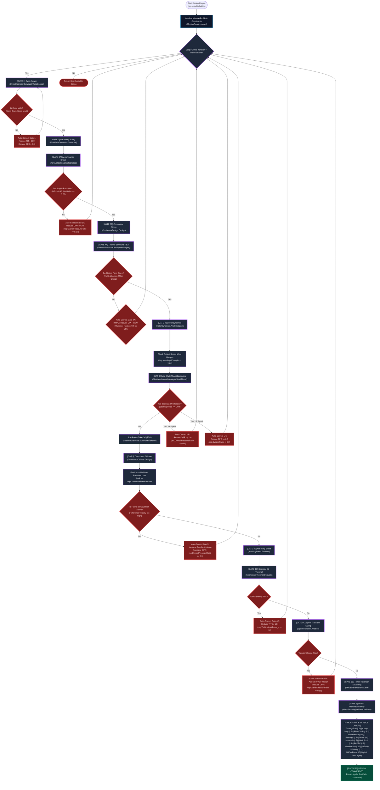
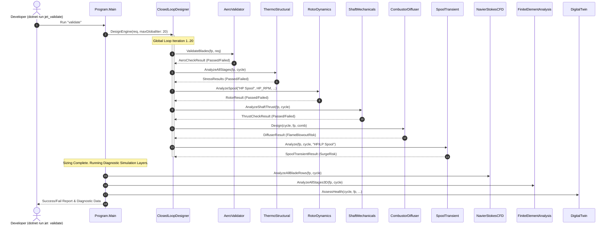

# JetEngine V6 Computational Design Platform: Workflow Chart

This document maps out the execution flow, physical solver modules, and the multi-disciplinary optimization (MDAO) closed-loop feedback design system implemented in [JetEngine V6.cs](file:///c:/Users/suryakumar%20M%20S/Downloads/Jet%20(2)/Jet/JetEngine%20V6.cs).

---

## 🗺️ Master Iterative Design Flowchart

The following flowchart shows the iterative, closed-loop execution inside `ClosedLoopDesigner.DesignEngine(...)`. If any gate or physical constraint fails, it dynamically adjusts the design parameters (such as BPR, OPR, or TIT) and loops back to **Gate 1** to re-solve the thermodynamic cycle.

---

## ⚙️ Detailed Phase-by-Phase Description

### 1. Thermodynamic & Aerodynamic Sizing (Gate 1 & 2)
*   **Station Properties Sizing:** The master `MissionRequirements` dictate the entry limits (Thrust, Mach, Altitude).
*   **Brayton Cycle Solver:** Solves the unmixed turbofan cycle from station 0 (ambient) through station 18 (nozzles). Incorporates variables such as:
    *   **Evaporative water/methanol injection** cooling at the inlet (Station 2).
    *   **Turbine cooling bleed mixing** (HPT coolant fraction extracted at Station 3 and re-injected at Station 45, dropping mixed-out gas enthalpy).
    *   **Supersonic shock loss correction** on the fan blade tip ($M_{1r,tip} > 1.0$) which drops fan stage polytropic efficiency.

### 2. Blade Geometry & Aerodynamic Verification (Gate 3A & 3B)
*   **Flow Path Generation:** Translates thermodynamic station volumes and RPM constraints into hub/tip radii profiles and axial stage blade sections.
*   **Aero Checks:** Calculates flow angles, velocity triangles, Diffusion Factors (must be $\le 0.45$), and De Haller numbers (must be $\ge 0.72$) to prevent local flow separation and aerodynamic stall.
*   **Combustor Design:** Applies Lefebvre combustor correlations to design the primary, intermediate, and dilution zones, balancing loading, pattern factor, and emissions indexes.

### 3. Structural, Vibration, and Rotordynamics (Gate 4A & 4B)
*   **Thermo-Structural FEA:** Solves centrifugal stress ($\sigma_{cf} = \rho \omega^2 \int r\,dr$) and thermal gradient stresses. Validates against the material's yield strength and Larson-Miller creep parameter (LMP) life boundaries.
*   **Rotor Critical Speeds:** Timoshenko beam solver calculates the critical whirl speeds of the High-Pressure (HP) and Low-Pressure (LP) shafts. Employs Campbell diagrams to verify a 15% clearance margin.
*   **Axial Thrust Balancing:** Resolves stage-by-stage pressure loads to compute net axial shaft thrust, sizing the balance piston to protect thrust bearings from overloading.

### 4. Thermal Systems & transient control (Gate 4D, 5C & 5E)
*   **Diffuser & Blowout Sizing:** Models diffuser pressure recovery and flags flame blowout risk if reference velocity exceeds limits.
*   **Gearbox Lube Oil Thermal Balance:** Computes heat dissipation from gears and bearings, verifying oil temperature is within material constraints (under the limit of Air-Cooled & Fuel-Cooled Oil Coolers).
*   **Spool Transient Acceleration:** Integrates spool polar moment of inertia to model throttle slam (idle $\to$ takeoff).
*   **Thrust Reverser & Landing:** Estimates dry runway stopping distance with bypass thrust reversal.

### 5. DMLS Manufacturability (Gate 6)
*   Verifies additive manufacturing (DMLS) requirements: wall thickness constraints, overhang limits, powder removal accessibility, and residual thermal stresses.

---

## 🛠️ Validation Run Execution Flow

When running `dotnet run jet_validate`, the platform executes a sequential diagnostic check across all gates and auxiliary simulation layers:

